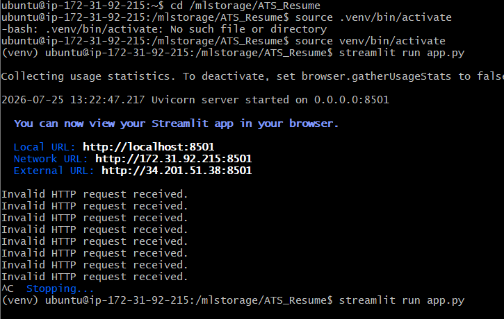
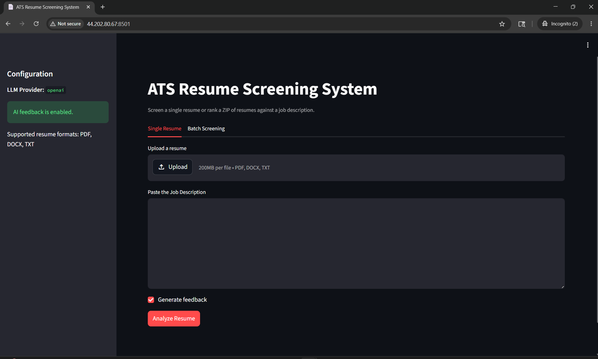
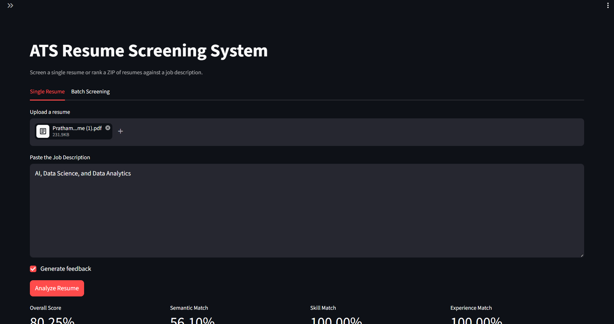
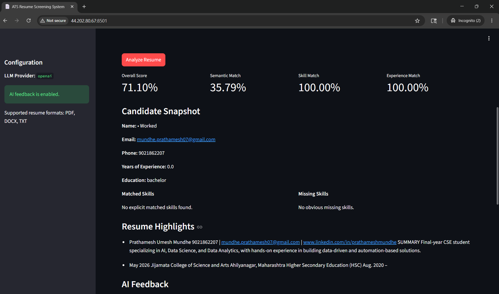
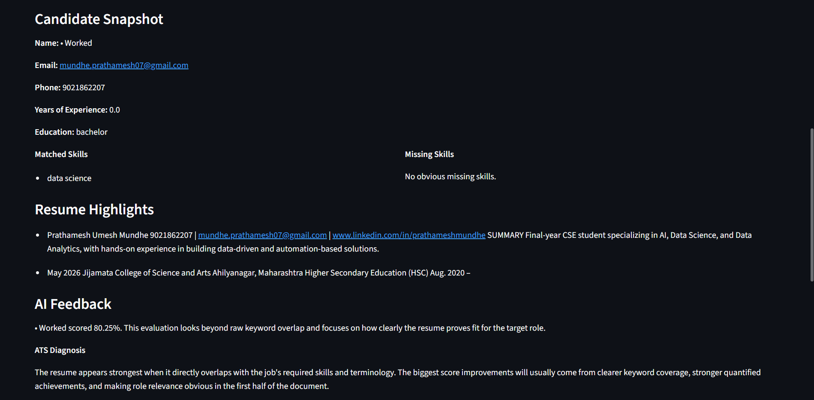

# AI Resume Screening System

##  Project Overview

The AI Resume Screening System is an intelligent web application that automates the resume screening process using Artificial Intelligence. It analyzes resumes against a given Job Description (JD), calculates an ATS compatibility score, identifies missing skills, and provides recommendations to improve the resume.

The application helps recruiters shortlist candidates efficiently while also assisting job seekers in optimizing their resumes for Applicant Tracking Systems (ATS).

---

#  Features

- Upload Resume in PDF format
- Upload Job Description
- ATS Resume Score
- Resume Skill Analysis
- Missing Skills Detection
- Resume Summary
- AI-Based Recommendations
- Keyword Matching
- Recruiter-Friendly Interface
- Fast Resume Processing

---

#  Technologies Used

| Technology | Purpose |
|------------|---------|
| Python | Backend Development |
| Streamlit | Web Application |
| Google Gemini AI | Resume Analysis |
| PDFPlumber | PDF Text Extraction |
| PyPDF2 | PDF Processing |
| spaCy | Natural Language Processing |
| Sentence Transformers | Semantic Similarity |
| Scikit-Learn | Machine Learning |
| Pandas | Data Processing |
| FastAPI | API Development |
| Uvicorn | API Server |
| Docker | Containerization |
| AWS EC2 | Cloud Deployment |
| Git & GitHub | Version Control |

---

#  Project Architecture

```text
               User
                 |
                 |
          Upload Resume (PDF)
                 |
                 |
        Streamlit Web Interface
                 |
                 |
        Resume Text Extraction
      (PDFPlumber / PyPDF2)
                 |
                 |
          Google Gemini AI
                 |
                 |
      ATS Resume Analysis Engine
                 |
        --------------------------
        |            |           |
 Resume Score   Missing Skills  Suggestions
        |
        |
     Display Result
```

---

# 📂 Project Structure

```text
AI-Resume-Screening/
│
├── app.py
├── requirements.txt
├── README.md
├── Dockerfile
├── .env
├── uploads/
├── static/
├── templates/
├── models/
└── utils/
```

---

#  Implementation Steps

---

## Step 1: Clone Repository

```bash
git clone https://github.com/yourusername/AI-Resume-Screening.git

cd AI-Resume-Screening
```


---

## Step 2: Create Virtual Environment

```bash
python -m venv venv
```

Activate Environment

### Windows

```bash
venv\Scripts\activate
```

### Linux

```bash
source venv/bin/activate
```


---

## Step 3: Install Dependencies

```bash
pip install -r requirements.txt
```


---

## Step 4: Configure Environment Variables

Create a `.env` file.

```text
GOOGLE_API_KEY=YOUR_API_KEY
```


---

## Step 5: Run Application

```bash

streamlit run app.py
```


 Screenshot



```

---

## Step 6: Upload Resume

Upload resume in PDF format.

 Screenshot





---

## Step 7: Upload Job Description

Upload or paste Job Description.

---

## Step 8: AI Resume Analysis

Google Gemini AI processes the resume and compares it with the Job Description.

The system performs:

- Resume Parsing
- Skill Extraction
- Keyword Matching
- ATS Score Calculation
- Missing Skill Detection
- Resume Recommendations


## Step 9: ATS Resume Score

Displays ATS Compatibility Score.

Example:

```text
ATS Score : 87%
```

Screenshot





## Step 10: Missing Skills

Shows skills missing from the resume.

Example:

- Docker
- Kubernetes
- AWS
- Terraform

 Screenshot


---

## Step 11: Resume Improvement Suggestions

Provides AI-generated suggestions to improve the resume.

📷 Screenshot




---

# 📊 Workflow

```text
Upload Resume
      │
      ▼
Extract PDF Text
      │
      ▼
Upload Job Description
      │
      ▼
Google Gemini AI Analysis
      │
      ▼
ATS Score
      │
      ├── Skill Matching
      ├── Missing Skills
      ├── Resume Summary
      └── Improvement Suggestions
```

---

# Screenshots

| Step | Screenshot |
|------|------------|
| Clone Repository | image/clone.png |
| Install Requirements | image/install.png |
| Configure .env | image/env.png |
| Run Application | image/run.png |
| Upload Resume | image/upload.png |
| Upload Job Description | image/jd.png |
| Resume Analysis | image/analysis.png |
| ATS Score | image/score.png |
| Missing Skills | image/missing.png |
| Suggestions | image/suggestion.png |

---

#  Project Output

- Resume uploaded successfully
- Job Description analyzed
- ATS Compatibility Score generated
- Missing Skills identified
- AI-generated Resume Suggestions displayed
- Resume evaluated using Google Gemini AI

---

#  Learning Outcomes

Through this project I learned:

- Artificial Intelligence
- Natural Language Processing
- Resume Parsing
- ATS Scoring
- Google Gemini AI Integration
- Streamlit Development
- FastAPI Development
- Docker
- AWS Cloud Deployment
- Python Backend Development

---

#  Future Enhancements

- Multi-Resume Screening
- Recruiter Dashboard
- Resume Ranking
- Candidate Shortlisting
- Email Notification
- Authentication & Login
- Database Integration
- Analytics Dashboard

---

#  Author

**Onkar Hol**

Cloud & AI Engineer

B.Tech Artificial Intelligence & Machine Learning

---

